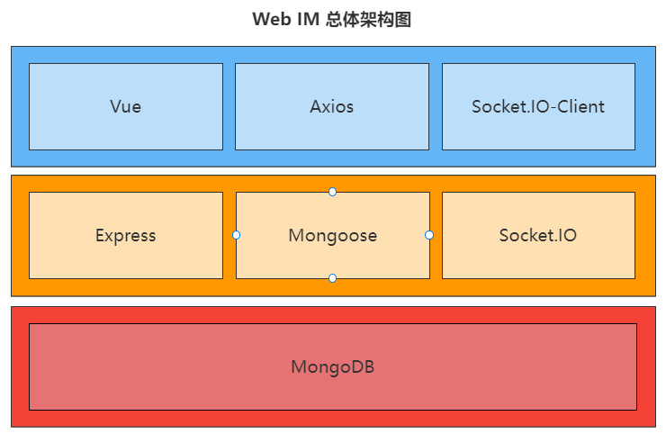
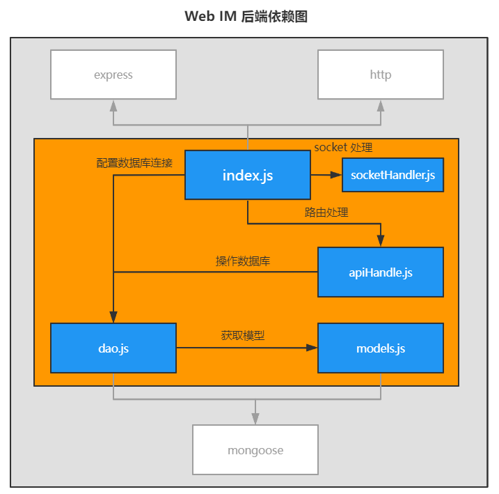

# np-webim-express

## Overall architecture diagram

Font-end repo: [np-webim-vue]([Sunwish/np-webim-vue: A web im single page front-end. (github.com)](https://github.com/Sunwish/np-webim-vue))



## File module division and dependency

In order to make the project structure clearer and the later maintenance more convenient, the back end is divided into dao.js、models.js、apiHandler.js and sockethandler.js several file modules. Of which:

- index.js is the back-end entry file, which is responsible for the creation and startup of HTTP server, including middleware configuration and module injection;

- socketHandler.js is responsible for handling socket related events, such as disconnect caused by user exit, which is captured and processed in the file;

- apiHandler.js is responsible for the processing of routing requests. Because the project is relatively simple, all post / get requests are processed directly in a single file;

- dao.js is responsible for implementing basic database operations, that is, adding, deleting, modifying and querying, and exposing asynchronous interfaces to the outside world;

- models.js defines the conceptual schema of all objects in the database.



## Project setup

```
npm install
```

### Start the server
```
node ./index.js
```

